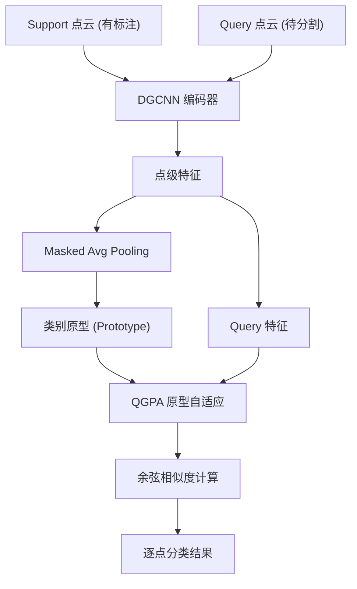

# 第1课：项目总览 — PAP-FZS3D 是什么

## 1. 本节学习目标

- 理解 3D 点云语义分割的问题定义
- 理解 Few-Shot 和 Zero-Shot 学习的核心概念
- 了解 PAP-FZS3D 的整体框架和创新点
- 能够浏览项目目录并理解各部分职责

---

## 2. 问题定义：3D 点云语义分割

### 什么是点云？

点云是三维空间中的一组离散点集合，每个点包含位置坐标 `(x, y, z)`，通常还附带颜色 `(R, G, B)`。点云一般通过 LiDAR、RGB-D 相机或三维扫描仪获得。

```
点云示例 (每个点 = 6维向量):
[x1, y1, z1, R1, G1, B1]
[x2, y2, z2, R2, G2, B2]
...
[xN, yN, zN, RN, GN, BN]
```

### 什么是语义分割？

语义分割的目标是 **为点云中的每个点分配一个语义类别标签**。

```
输入:  N x 6 的点云
输出:  N 个类别标签 (如 wall, floor, chair, table...)
```

### 核心挑战

| 挑战 | 说明 |
|---|---|
| **无序性** | 点是集合而非序列，输入顺序不应影响输出 |
| **稀疏性** | 只有物体表面有点，内部为空 |
| **非结构化** | 不同于图像的规则网格，点云没有固定拓扑 |
| **标注成本高** | 3D 点云的人工标注远比 2D 图像困难 |

---

## 3. Few-Shot 与 Zero-Shot 学习

### 为什么需要少样本学习？

传统的全监督语义分割需要大量标注数据（每个类成千上万个样本）。但 3D 点云的标注极其昂贵——标注一个大型室内场景可能需要数小时。

PAP-FZS3D 尝试回答：

> **能否只用 1~5 个标注样本来识别新类别的点？**

### Few-Shot Learning (FSL)

**N-way K-shot** 是 FSL 的标准协议：

```
N-way: 每个 episode 包含 N 个类别
K-shot: 每个类别只有 K 个有标注的 support 样本
```

例如 `2-way 1-shot`：从 2 个新类别中各取 1 个已标注样本来学习分割。

### Zero-Shot Learning (ZSL)

更极端的情况：**某些类别完全没有标注样本**。模型需要通过类别名称的语义信息（如词向量）来理解从未见过的类别。

```
Known:  wall     → 有标注样本 + 词向量 "wall"
Unknown: sofa    → 只有词向量 "sofa"，从无标注样本
目标:   通过词向量桥接 → 能分割出 sofa
```

---

## 4. PAP-FZS3D 的核心思想

PAP-FZS3D 采用 **度量学习（Metric Learning）** 范式：



**核心流程**：

1. **编码**：DGCNN 将点云映射到高维嵌入空间
2. **原型计算**：从 support 样本中提取每个类的代表性向量（原型）
3. **自适应**：QGPA 模块根据 query 特征调整原型
4. **匹配**：计算 query 点特征与各原型的余弦相似度，最相似的即为其类别

### 关键创新点

| 创新 | 位置 | 功能 |
|---|---|---|
| **QGPA (Query-Guided Prototype Alignment)** | `models/attention.py` | 根据查询场景自适应调整原型 |
| **Self-Reconstruction** | `models/protonet_QGPA.py` | 通过重建约束增强原型质量 |
| **GMMN Generator** | `models/gmmn.py` | 从词嵌入生成未见类的伪视觉原型 |
| **Multi-level Features** | `models/protonet_QGPA.py` | 拼接多层特征增强表示能力 |

---

## 5. 项目文件结构速览

```
PAP-FZS3D/
├── main.py                     ★ 主入口
├── models/                     ★ 模型定义
│   ├── dgcnn.py/dgcnn_new.py     DGCNN 骨干网络
│   ├── attention.py              注意力模块 (SelfAttention, QGPA)
│   ├── protonet.py               ProtoNet 基础实现
│   ├── protonet_QGPA.py          PAP (QGPA + SR)
│   ├── protonet_FZ.py            PAP-FZ (GMMN 扩展)
│   ├── gmmn.py                   GMMN 生成器
│   ├── proto_learner.py          训练/测试循环
│   └── proto_learner_FZ.py       FZ 训练循环
├── dataloaders/                数据加载
│   ├── loader.py                 核心: Episode/Test/Pretrain Dataset
│   ├── s3dis.py                  S3DIS 数据集配置
│   └── scannet.py                ScanNet 数据集配置
├── runs/                       训练/评估脚本
│   ├── pre_train.py              预训练
│   ├── proto_train.py            元训练
│   └── eval.py                   评估
├── scripts/                    实验脚本 (*.sh)
├── utils/                      工具函数
└── preprocess/                 数据预处理
```

---

## 6. 实践：浏览项目

运行以下命令建立对项目的初步认识：

```bash
# 查看目录结构
ls -la PAP-FZS3D/

# 查看 main.py 支持的参数
python main.py --help

# 浏览实验脚本
cat scripts/train_PAP.sh
cat scripts/train_PAPFZ.sh

# 了解依赖关系 (虽然没有 requirements.txt)
grep -r "^import torch" models/ | head -20
grep -r "^from torch" models/ | head -20
```

---

## 7. 本节总结

| 概念 | 要点 |
|---|---|
| 3D 点云语义分割 | 为无序点集合中的每个点分配语义标签 |
| Few-Shot Learning | N-way K-shot：每个类只有 K 个标注样本 |
| Zero-Shot Learning | 通过语义信息（词向量）识别从未见过的类别 |
| 度量学习 | 嵌入空间 + 原型 + 距离度量 |
| 项目入口 | `main.py` 通过 `--phase` 参数路由到不同功能 |

### 关键文件

- 入口：`main.py`
- 核心模型：`models/protonet_QGPA.py`、`models/attention.py`
- 数据：`dataloaders/loader.py`
- 实验脚本：`scripts/*.sh`

---

## 8. 课后练习

1. 访问 [arXiv 2305.14335](https://arxiv.org/pdf/2305.14335.pdf) 浏览论文摘要，了解核心贡献
2. 运行 `python main.py --help` 并记录所有可用的 `--phase` 选项
3. 用 `tree` 命令（或 IDE）浏览完整目录结构，标注出 5 个你认为最重要的文件
4. 思考：为什么要用"原型"来代表一个类，而不是传统的分类器权重？
