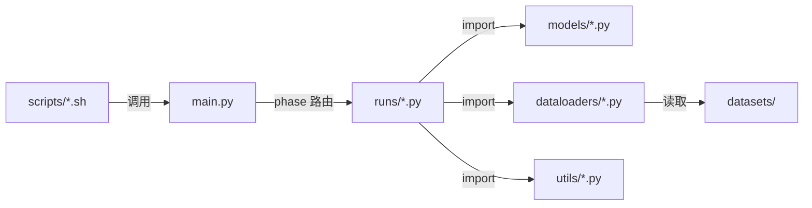
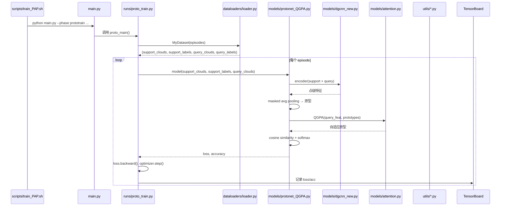

# 第3课：项目代码架构总览

## 1. 本节学习目标

- 理解各目录的职责划分
- 掌握模块间的依赖关系
- 能够绘制项目的调用关系图
- 建立对代码结构的整体心智模型

---

## 2. 为什么先看架构

在逐行阅读代码之前，先建立 **全局架构图** 至关重要。这能避免"只见树木不见森林"的问题——每一行代码都应该在整体架构中有明确的位置。

> 好的架构理解 = 50% 的代码阅读效率提升

---

## 3. 目录职责划分

```
PAP-FZS3D/
├── main.py              总调度器：解析参数 → 路由 phase → 分发任务
├── models/              纯粹的模型定义 (nn.Module)
├── dataloaders/         数据 I/O：从磁盘到 GPU Tensor
├── runs/                训练/评估逻辑：loss 计算、optimizer、日志
├── utils/               可复用工具 (checkpoint、CUDA、日志)
├── preprocess/          一次性数据处理脚本
├── scripts/             实验启动脚本 (Bash)
└── datasets/            数据集存放目录 (不包含在代码中)
```

### 职责边界



**关键原则**：

- `models/` 是无状态的（纯前向传播），不应包含训练逻辑
- `runs/` 负责编排训练流程，包含 loss / optimizer / 日志
- `dataloaders/` 只关心数据如何变成 Tensor，不关心模型
- `main.py` 只负责参数解析和路由，不包含业务逻辑

---

## 4. 数据流全貌

一次完整的 Few-Shot 训练迭代：



---

## 5. 模块依赖图

```
main.py
├── runs/pre_train.py ────────────── models/dgcnn_new.py (DGCNNSeg)
│   ├── dataloaders/loader.py (MyPretrainDataset)
│   ├── dataloaders/s3dis.py
│   └── utils/checkpoint_util.py
│
├── runs/proto_train.py ──────────── models/proto_learner.py
│   ├── dataloaders/loader.py (MyDataset, MyTestDataset)
│   ├── models/protonet_QGPA.py ──── models/dgcnn_new.py
│   │   └── models/attention.py (SelfAttention, QGPA)
│   └── models/proto_learner_FZ.py
│       └── models/protonet_FZ.py ── models/gmmn.py
│           └── models/attention.py
│
├── runs/mpti_train.py ──────────── models/mpti_learner.py
│   └── models/mpti.py
│
├── runs/fine_tune.py ───────────── models/dgcnn_new.py
│
└── runs/eval.py ────────────────── models/proto_learner.py
```

### 依赖层级

| 层级 | 模块 | 被依赖方 |
|---|---|---|
| L0: 基础工具 | `utils/*`, `dataloaders/*` | 被所有上层依赖 |
| L1: 模型定义 | `models/dgcnn*.py`, `models/attention.py`, `models/gmmn.py` | 被模型组装层依赖 |
| L2: 模型组装 | `models/protonet*.py`, `models/mpti*.py` | 被学习器依赖 |
| L3: 学习器 | `models/proto_learner*.py`, `models/mpti_learner.py` | 被运行脚本依赖 |
| L4: 运行脚本 | `runs/*.py` | 被 main.py 调用 |
| L5: 入口 | `main.py` | 被 shell 脚本调用 |

---

## 6. 模型层级详解

### 三层模型设计

```
Layer 1: 基础算子
   models/dgcnn.py        → EdgeConv (点云卷积)
   models/dgcnn_new.py    → DGCNN_semseg (语义分割骨干)
   models/attention.py    → SelfAttention, QGPA (注意力)
   models/gmmn.py         → GMMNnetwork (生成器)

Layer 2: 方法定义
   models/protonet.py     → ProtoNet (基础原型网络)
   models/protonet_QGPA.py→ ProtoNetAlignQGPASR (含 QGPA + SR)
   models/protonet_FZ.py  → ProtoNetAlignFZ (含 GMMN 生成)
   models/mpti.py         → MPTI (传导推理)

Layer 3: 训练封装
   models/proto_learner.py    → ProtoLearner (训练+测试)
   models/proto_learner_FZ.py → ProtoLearnerFZ (FZ训练+测试)
   models/mpti_learner.py     → MPTILeaner (MPTI训练+测试)
```

---

## 7. 实践：绘制模块依赖图

### 任务：找出 `protonet_QGPA.py` 的所有依赖

在 `models/protonet_QGPA.py` 中搜索所有的 import：

```python
from models.dgcnn_new import DGCNN_semseg   # 骨干网络
from models.attention import SelfAttention   # 自注意力
from models.attention import QGPA            # 交叉注意力
import torch.nn as nn
import torch.nn.functional as F
import torch
```

这说明 `protonet_QGPA.py` 依赖于：
- `dgcnn_new.py` (特征提取)
- `attention.py` (注意力机制)

### 任务：追踪 main.py → proto_train.py 的调用链

```
main.py:172  → elif args.phase == 'prototrain':
                   proto_main(args)
                   
runs/proto_train.py  → def proto_main(args):
                           model = ProtoNetAlignQGPASR(args)  # 或 ProtoNetAlignFZ
                           proto_learner = ProtoLearner(args)  # 或 ProtoLearnerFZ
                           proto_learner.train(...)
```

---

## 8. 本节总结

| 目录 | 职责 | 关键文件 |
|---|---|---|
| `main.py` | 参数解析 + 路由 | — |
| `models/` | 模型定义 (纯 nn.Module) | `protonet_QGPA.py`, `attention.py` |
| `dataloaders/` | 数据 I/O | `loader.py` |
| `runs/` | 训练/评估逻辑 | `proto_train.py`, `eval.py` |
| `utils/` | 工具函数 | `checkpoint_util.py`, `cuda_util.py` |
| `preprocess/` | 一次性预处理 | `collect_s3dis_data.py` |
| `scripts/` | 实验脚本 | `train_PAP.sh`, `eval_PAP.sh` |

**架构原则**：分层设计 — 底层工具 → 模型定义 → 模型组装 → 训练编排 → 入口调度

---

## 9. 课后练习

1. 用 Mermaid 或手绘方式画出项目的模块依赖图（参考第5节）
2. 找出所有 `import models.dgcnn_new` 的文件并列出它们
3. 选择一个 phase（如 `prototrain`），从 `main.py` 开始追踪完整的函数调用链
4. 回答：如果要在项目中新增一个数据集，需要修改哪些文件？
