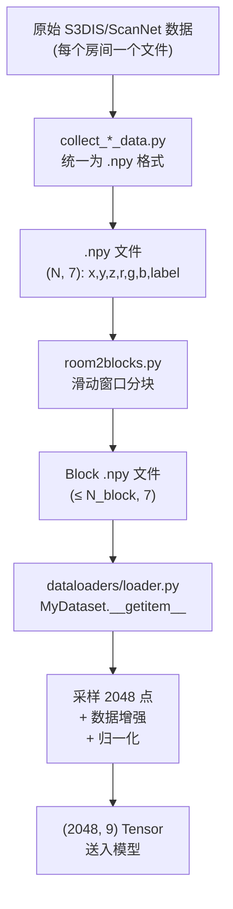

# 第5课：点云数据表示与预处理

## 1. 本节学习目标

- 理解点云数据的表示格式（XYZ + RGB + 归一化 XYZ）
- 掌握点采样（FPS/随机采样）策略
- 理解数据增强方法（旋转、缩放、平移）
- 能够运行预处理脚本

---

## 2. 点云数据的维度

### 原始点云

PAP-FZS3D 使用的点云属性由 `--pc_attribs` 参数控制：

```python
# 默认值: 'xyzrgbXYZ'
# 含义: 9 维特征
#   x, y, z     → 原始坐标
#   r, g, b     → 颜色 (归一化到 [0, 1])
#   X, Y, Z     → 归一化坐标 (减去均值, 除以最大范围)
```

每个点的特征向量：

```
┌─────┬─────┬─────┬─────┬─────┬─────┬─────┬─────┬─────┐
│  x  │  y  │  z  │  r  │  g  │  b  │  X  │  Y  │  Z  │
└─────┴─────┴─────┴─────┴─────┴─────┴─────┴─────┴─────┘
 原始坐标         颜色 (0-1)          归一化坐标
```

### 为什么需要归一化坐标？

- **平移不变性**：使模型对不同房间大小不敏感
- **数值稳定性**：归一化后坐标落在 `[-1, 1]` 范围，梯度更稳定
- **保留原始坐标**：原始坐标保留了绝对位置信息（天花板高 vs 地板低）

---

## 3. 点采样策略 (pc_npts)

每个房间的点云可能有几万到几十万个点，需要采样到固定数量（默认 2048 点）。

### 采样方法

```python
# dataloaders/loader.py 中的采样逻辑 (简化)
def sample_points(points, npts=2048):
    N = points.shape[0]
    if N >= npts:
        # 随机采样
        idx = np.random.choice(N, npts, replace=False)
    else:
        # 上采样 (复采样)
        idx = np.random.choice(N, npts, replace=True)
    return points[idx], idx
```

### FPS (Farthest Point Sampling)

在预处理阶段使用 FPS 来选择有代表性的点：

```python
# 使用 torch_cluster 的 FPS
from torch_cluster import fps

# 对每个 block 执行 FPS
center_idx = fps(points, batch, ratio=0.5)  # 采样 50% 的点
```

FPS 的优势：保证采样点在空间中均匀分布，避免随机采样导致的局部密集。

---

## 4. 数据增强

数据增强在 data loader 中实时进行，由 `--pc_augm` 控制。

### 增强类型

```python
# dataloaders/loader.py (简化)
def augment(points):
    # 1. 随机旋转 (绕 Z 轴)
    theta = np.random.uniform(0, 2 * np.pi)
    rot_mat = np.array([
        [np.cos(theta), -np.sin(theta), 0],
        [np.sin(theta),  np.cos(theta), 0],
        [0,              0,             1]
    ])
    points[:, :3] = points[:, :3] @ rot_mat.T
    
    # 2. 随机缩放
    scale = np.random.uniform(0.8, 1.25)
    points[:, :3] *= scale
    
    # 3. 随机平移
    jitter = np.random.normal(0, 0.01, (1, 3))
    points[:, :3] += jitter
    
    # 4. 颜色增强 (可选)
    points[:, 3:6] *= np.random.uniform(0.8, 1.2)
    
    return points
```

### 增强策略的考量

| 增强方法 | 物理含义 | 适用性 |
|---|---|---|
| Z 轴旋转 | 室内场景视角旋转 | 总是有效 |
| 随机缩放 | 房间大小变化 | 谨慎使用 |
| 平移/抖动 | 传感器噪声 | 有利鲁棒性 |
| 颜色抖动 | 光照变化 | 可选 |

---

## 5. 预处理流程

### room2blocks.py：房间分块

室内场景太大（一个房间几万点），需要分成固定大小的 block：

```python
# preprocess/room2blocks.py 的核心逻辑 (简化)
def room2blocks(data, block_size=1.0, stride=0.5):
    """
    data: (N, 6) 的房间点云
    block_size: 每个 block 的边长 (米)
    stride: 滑动窗口步长
    """
    blocks = []
    # 在 XY 平面上滑动
    for x in range(min_x, max_x, stride):
        for y in range(min_y, max_y, stride):
            # 提取 block 内的点
            mask = ((points[:, 0] >= x) & 
                    (points[:, 0] < x + block_size) &
                    (points[:, 1] >= y) & 
                    (points[:, 1] < y + block_size))
            block_points = points[mask]
            if len(block_points) > min_points:  # 跳过点数太少的 block
                blocks.append(block_points)
    return blocks
```

### collect_*_data.py：数据格式转换

```bash
# 将 S3DIS 原始标注转换为 .npy 格式
python preprocess/collect_s3dis_data.py

# 输入: datasets/S3DIS/data/Area_*/  (原始 txt 文件)
# 输出: datasets/S3DIS/*.npy         (NumPy 数组)
```

每个 `.npy` 文件的格式：

```python
# 每行: x, y, z, r, g, b, label
# shape: (N, 7)
```

---

## 6. 实践：可视化点云采样

```python
import numpy as np
import matplotlib.pyplot as plt

# 生成采样点并可视化
points = np.random.randn(2048, 3) * 2
sampled_idx = np.random.choice(2048, 512, replace=False)

fig = plt.figure(figsize=(10, 4))
ax1 = fig.add_subplot(121, projection='3d')
ax1.scatter(points[:, 0], points[:, 1], points[:, 2], s=1)
ax1.set_title('Before (2048 points)')

ax2 = fig.add_subplot(122, projection='3d')
ax2.scatter(points[sampled_idx, 0], 
            points[sampled_idx, 1], 
            points[sampled_idx, 2], s=1)
ax2.set_title('After (512 points)')
plt.show()
```

---

## 7. 数据预处理的完整流程



---

## 8. 本节总结

| 概念 | 要点 |
|---|---|
| 点属性 | 9 维: xyz + rgb + XYZ（原始 + 归一化） |
| 点采样 | 随机采样到 2048 点，FPS 用于预处理 |
| 数据增强 | 旋转 + 缩放 + 平移 + 颜色抖动 |
| room2blocks | 滑动窗口将大房间切成小块 |
| 归一化 | 减去均值，除以范围 → [-1, 1] |

---

## 9. 课后练习

1. 写一个简单的点云增强函数，实现旋转+缩放+平移
2. 解释为什么需要同时保留原始坐标（XYZ）和归一化坐标（xyz）
3. 如果用 FPS 替代随机采样，对训练会有什么影响？（提示：多样性 vs 稳定性）
4. 查看 `dataloaders/loader.py` 中 `MyDataset.__getitem__` 的完整实现，画出数据从磁盘到 Tensor 的流程图
