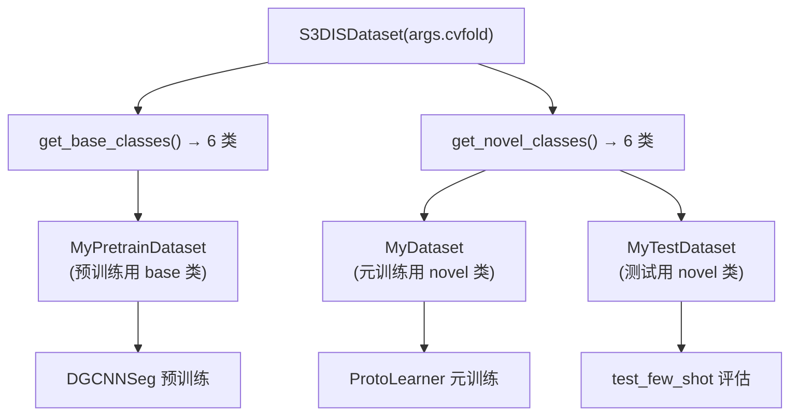

# 第6课：S3DIS 与 ScanNet 数据集

## 1. 本节学习目标

- 理解 S3DIS 和 ScanNet 数据集的结构
- 掌握数据集的类划分与 2-fold 交叉验证
- 理解 base/novel class 的概念
- 能够阅读和理解数据集配置代码

---

## 2. 数据集对比

| 特性 | S3DIS | ScanNet |
|---|---|---|
| **全称** | Stanford 3D Indoor Spaces | ScanNetV2 |
| **场景** | 6 个大型室内区域 | 1513 个扫描场景 |
| **类别数** | 13 (含 clutter) | 21 (含 unannotated) |
| **点属性** | XYZ + RGB | XYZ + RGB |
| **标注类型** | 逐点语义标签 | 逐点语义标签 |
| **挑战** | 区域差异大 | 场景多样性强 |

---

## 3. S3DIS 数据集

### 空间划分（6 个 Area）

```
Stanford 大学办公楼:
Area_1: 入口大厅、走廊
Area_2: 会议室区域  
Area_3: 办公区
Area_4: 学术区
Area_5: 报告厅区域
Area_6: 教室区域
```

### 类划分 (13 类)

```python
# dataloaders/s3dis.py
S3DIS_CLASSES = [
    'ceiling',   # 天花板
    'floor',     # 地板
    'wall',      # 墙壁
    'beam',      # 横梁
    'column',    # 柱子
    'window',    # 窗户
    'door',      # 门
    'table',     # 桌子
    'chair',     # 椅子
    'sofa',      # 沙发
    'bookcase',  # 书架
    'board',     # 黑板/白板
    'clutter'    # 杂物 (通常被忽略)
]
```

### 2-fold 交叉验证

```python
# fold_0: 训练这些类 → 测试另一些类
FOLD_0_TRAIN = [beam, board, bookcase, ceiling, chair, column]
FOLD_0_TEST  = [door, floor, sofa, table, wall, window]

# fold_1: 角色互换
FOLD_1_TRAIN = [door, floor, sofa, table, wall, window]
FOLD_1_TEST  = [beam, board, bookcase, ceiling, chair, column]
```

**为什么要这样划分？**

- 模拟 "遇到新类别" 的真实场景
- 训练和测试的类别 **完全不同**，测试泛化能力
- 2-fold 确保每个类都当过训练类，也当过测试类

### Base vs Novel Class

```python
# 在少样本学习中:
BASE_CLASSES  = FOLD_X_TRAIN  # 预训练阶段使用（全量标注）
NOVEL_CLASSES = FOLD_X_TEST   # 少样本测试阶段（仅 K 个标注）
```

---

## 4. ScanNet 数据集

### 类划分 (21 类, 实际使用 20 类)

```python
# dataloaders/scannet.py
SCANNET_CLASSES = [
    'wall', 'floor', 'chair', 'table', 'desk', 
    'bed', 'bookshelf', 'sofa', 'sink', 'bathtub',
    'toilet', 'curtain', 'counter', 'door', 'window',
    'shower curtain', 'refrigerator', 'picture', 
    'cabinet', 'otherfurniture'
]
# 'unannotated' 类被排除
```

### 2-fold 划分

```python
# 10+10 划分
FOLD_0_TRAIN = [wall, floor, chair, table, desk, 
                bed, bookshelf, sofa, sink, bathtub]
FOLD_0_TEST  = [toilet, curtain, counter, door, window,
                shower curtain, refrigerator, picture, 
                cabinet, otherfurniture]

FOLD_1_TRAIN = FOLD_0_TEST
FOLD_1_TEST  = FOLD_0_TRAIN
```

---

## 5. 数据集配置代码解读

### S3DISDataset 类

```python
# dataloaders/s3dis.py (简化)
class S3DISDataset():
    def __init__(self, cvfold=0):
        self.cvfold = cvfold
        
        # 所有类名
        self.classes = S3DIS_CLASSES  # 13 个类
        
        # 根据 fold 划分 base/novel
        if cvfold == 0:
            self.base_classes = FOLD_0_TRAIN  # 6 个类
            self.novel_classes = FOLD_0_TEST  # 6 个类
        elif cvfold == 1:
            self.base_classes = FOLD_1_TRAIN
            self.novel_classes = FOLD_1_TEST
            
    def get_base_classes(self):
        return self.base_classes
    
    def get_novel_classes(self):
        return self.novel_classes
```

### 类名到索引的映射

```python
# 在 loader.py 中，类名被转换为索引
class2idx = {
    'beam': 0, 'board': 1, 'bookcase': 2, 
    'ceiling': 3, 'chair': 4, 'column': 5,
    ...
}
```

---

## 6. 数据加载链路



---

## 7. class2scans 映射文件

数据集初始化时会生成 `class2scans.pkl`：

```python
# dataloaders/loader.py (简化)
def build_class2scans(dataset_path, classes):
    """
    遍历所有 .npy 文件，记录每个类出现在哪些文件的哪些位置
    """
    class2scans = {}
    for cls_name in classes:
        class2scans[cls_name] = []
    
    for npy_file in glob.glob(f'{dataset_path}/*.npy'):
        data = np.load(npy_file)
        labels = data[:, -1]  # 最后一列是标签
        for cls_idx, cls_name in enumerate(classes):
            if (labels == cls_idx).sum() > min_points:
                class2scans[cls_name].append((npy_file, cls_idx))
    
    return class2scans
```

这个映射文件用于：
- Episode 采样时快速定位包含特定类的 block
- 测试时构建 episode 组合

---

## 8. 本节总结

| 数据集 | 类数 | Fold 0 训练类 | Fold 0 测试类 |
|---|---|---|---|
| S3DIS | 13 (含clutter) | beam, board, bookcase, ceiling, chair, column | door, floor, sofa, table, wall, window |
| ScanNet | 20 | 10 类 | 另外 10 类 |
| Fold 1 | — | 互换 | 互换 |

**关键概念**：
- **Base Classes**：全量标注，用于预训练
- **Novel Classes**：每个类只有 K 个标注样本，用于少样本学习
- **2-fold 交叉验证**：每个类互相充当 base/novel，消除划分偏置

---

## 9. 课后练习

1. 列出 S3DIS fold_0 的 6 个 novel 类，思考它们有什么共同特征
2. 修改 `dataloaders/scannet.py`，尝试设计一个 3-fold 的类划分方案
3. 阅读 `dataloaders/loader.py` 中 `build_class2scans()` 的完整实现
4. 思考：为什么 clutter 在 S3DIS 中通常被排除？（提示：clutter 包含哪些东西？）
