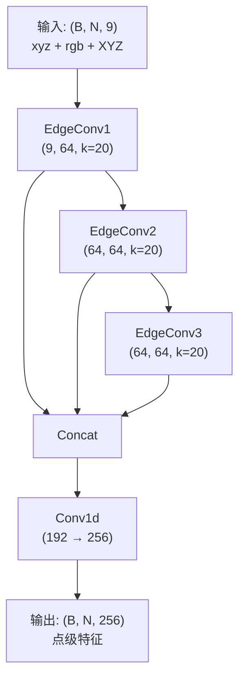

# 第11课：DGCNN 完整架构

## 1. 本节学习目标

- 掌握 DGCNN 分类/分割的完整网络结构
- 理解多层 EdgeConv 堆叠的设计原理
- 理解 DGCNN_cls、DGCNN_partseg、DGCNN_semseg 的区别
- 能够将 DGCNN 作为特征提取器（encoder）使用

---

## 2. DGCNN 家族

PAP-FZS3D 项目中包含两个 DGCNN 实现：

| 文件 | 类/函数 | 用途 |
|---|---|---|
| `models/dgcnn.py` | `DGCNN` | 基础 DGCNN，较旧版本 |
| `models/dgcnn_new.py` | `DGCNN_cls` | 分类任务版本 |
| `models/dgcnn_new.py` | `DGCNN_partseg` | 部件分割版本 |
| `models/dgcnn_new.py` | `DGCNN_semseg` | 语义分割版本（**本项目使用**） |

### 选择逻辑

```python
# 在 protonet_QGPA.py 中
if args.use_high_dgcnn:
    self.encoder = DGCNN_semseg(args)  # 使用新版本
else:
    self.encoder = DGCNN(args)         # 使用旧版本
```

---

## 3. DGCNN_semseg 架构详解

### 整体结构



### 关键设计：跳跃连接

不同于分类网络只用最后一层，**语义分割** 需要多层特征拼接：

```python
# dgcnn_new.py: DGCNN_semseq (简化)
class DGCNN_semseg(nn.Module):
    def __init__(self, args):
        super().__init__()
        self.k = args.dgcnn_k  # 20
        
        # 3 层 EdgeConv
        self.edgeconv1 = EdgeConv(9, 64, self.k)
        self.edgeconv2 = EdgeConv(64, 64, self.k)
        self.edgeconv3 = EdgeConv(64, 64, self.k)
        
        # 特征融合
        self.conv1 = nn.Sequential(
            nn.Conv1d(64*3, 256, 1),  # 拼接 3 层 → 256
            nn.BatchNorm1d(256),
            nn.LeakyReLU(0.2)
        )
    
    def forward(self, x):
        B, N, D = x.shape
        
        # 保存每层输出用于拼接
        x1 = self.edgeconv1(x)  # (B, N, 64)
        x2 = self.edgeconv2(x1) # (B, N, 64)
        x3 = self.edgeconv3(x2) # (B, N, 64)
        
        # 多层特征拼接
        x = torch.cat([x1, x2, x3], dim=2)  # (B, N, 192)
        
        # 融合
        x = x.permute(0, 2, 1)  # (B, 192, N)
        x = self.conv1(x)        # (B, 256, N)
        x = x.permute(0, 2, 1)  # (B, N, 256)
        
        return x  # 点级特征
```

### 为什么需要拼接多层特征

| 层 | 感受野 | 捕获的几何信息 |
|---|---|---|
| EdgeConv1 | 局部 (~0.1m) | 边、角、小曲面 |
| EdgeConv2 | 中尺度 (~0.5m) | 局部形状、曲面 |
| EdgeConv3 | 大尺度 (~2m) | 全局物体形状 |

拼接后，模型同时拥有局部细节和全局形状信息。

---

## 4. 三种 DGCNN 对比

### DGCNN_cls (分类)

```python
# 用于全局物体分类
# 输出: 全局特征 → class logits
class DGCNN_cls(nn.Module):
    def forward(self, x):
        x1 = self.edgeconv1(x)
        x2 = self.edgeconv2(x1)
        x3 = self.edgeconv3(x2)
        
        x = torch.cat([x1, x2, x3], dim=2)  # (B, N, 192)
        x = x.max(dim=1)[0]                   # (B, 192) ← 全局最大池化
        x = self.fc(x)                         # (B, num_classes)
        return x
```

### DGCNN_partseg (部件分割)

```python
# 输入 + 全局信息，用于部件分割
class DGCNN_partseg(nn.Module):
    def forward(self, x, cls_label):
        x1 = self.edgeconv1(x)
        x2 = self.edgeconv2(x1)
        x3 = self.edgeconv3(x2)
        
        x = torch.cat([x1, x2, x3], dim=2)   # (B, N, 192)
        x_global = x.max(dim=1)[0]             # (B, 192)
        x_global = torch.cat([x_global, cls_label_onehot], dim=1)
        x_global = x_global.unsqueeze(1).expand(-1, N, -1)
        
        x = torch.cat([x, x_global], dim=2)   # 拼接全局信息
        x = self.seg_head(x)                    # 分割头
        return x
```

### DGCNN_semseg (语义分割)

```python
# 仅需要点级特征，不需要全局池化
class DGCNN_semseg(nn.Module):
    def forward(self, x):
        x1 = self.edgeconv1(x)
        x2 = self.edgeconv2(x1)
        x3 = self.edgeconv3(x2)
        
        x = torch.cat([x1, x2, x3], dim=2)  # (B, N, 192)
        x = x.permute(0, 2, 1)
        x = self.conv1(x)                      # (B, 256, N)
        x = x.permute(0, 2, 1)
        
        return x  # 返回逐点特征，无需全局池化
```

---

## 5. 为什么 DGCNN 适合作为 Few-Shot 的 Encoder

### 优势

| 属性 | 说明 |
|---|---|
| **逐点特征** | 输出 (N, D)，每个点有独立的特征向量 |
| **几何感知** | EdgeConv 捕获局部形状，适合分割 |
| **感受野** | 动态图更新增大感受野，信息充分传播 |
| **轻量** | 参数量约 0.3M，适合少样本场景（不易过拟合） |
| **可迁移** | 预训练的特征对 novel classes 有泛化能力 |

### 对比其他骨架

| 编码器 | 参数量 | Few-Shot 适用性 | 说明 |
|---|---|---|---|
| DGCNN | ~0.3M | ⭐⭐⭐⭐⭐ | 轻量，局部感知好 |
| PointNet++ | ~1M | ⭐⭐⭐⭐ | 层次特征好，略重 |
| PointTransformer | ~2M | ⭐⭐⭐ | 全局建模强，但易过拟合 |
| MinkowskiNet | ~5M | ⭐⭐ | 太重，Few-Shot 过拟合 |

---

## 6. 代码中的通道配置

```python
# dgcnn_new.py 中的配置
# EdgeConv 宽度: [[64,64], [64,64], [64,64]]
# 含义: 每层 EdgeConv (输入通道, 输出通道)

# 完整的数据流:
输入:  (B, N, 9)
→ EC1(9, 64):    (B, N, 64)
→ EC2(64, 64):   (B, N, 64)
→ EC3(64, 64):   (B, N, 64)
→ Concat:        (B, N, 192)
→ Conv(192, 256):(B, N, 256)
→ 输出
```

---

## 7. 实践：打印 DGCNN 输出形状

```python
import torch
from models.dgcnn_new import DGCNN_semseg
from types import SimpleNamespace

# 模拟 args
args = SimpleNamespace(
    dgcnn_k=20,
    edgeconv_widths=[[64,64],[64,64],[64,64]],
    dgcnn_mlp_widths=[512, 256]
)

model = DGCNN_semseg(args)
x = torch.randn(2, 2048, 9)  # batch=2, 2048点, 9维特征

with torch.no_grad():
    out = model(x)
    print(f"Input:  {x.shape}")
    print(f"Output: {out.shape}")
    print(f"Params: {sum(p.numel() for p in model.parameters()):,}")
```

---

## 8. 本节总结

| 版本 | 输出 | 用途 |
|---|---|---|
| DGCNN_cls | (B, num_classes) | 物体分类 |
| DGCNN_partseg | (B, N, num_parts) | 部件分割 |
| **DGCNN_semseg** | **(B, N, 256)** | **语义分割 encoder** |

**核心设计**：
1. 3 层 EdgeConv (通道: 9→64→64→64)
2. 多层级特征拼接 (192 维)
3. 1x1 Conv 融合 (256 维)
4. 无需全局池化，保留逐点特征

---

## 9. 课后练习

1. 画出 DGCNN_semseg 的完整张量流图（标注每步的形状）
2. 对比 DGCNN_cls 和 DGCNN_semseg，为什么分割版保留了 N 维度？
3. 如果要改用 DGCNN_partseg 作为 encoder，PAP 需要做哪些修改？
4. 计算 DGCNN_semseg 的总参数量（手算或代码统计）
