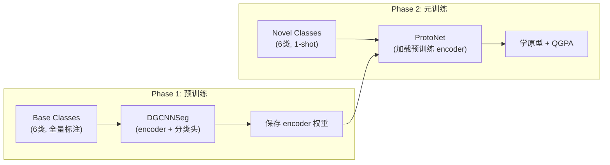

# 第12课：DGCNNSeg 预训练流程

## 1. 本节学习目标

- 理解预训练（Pretraining）在少样本学习中的作用
- 掌握 DGCNNSeg 的结构（DGCNN + 分类头）
- 能够运行和理解预训练脚本
- 理解预训练 checkpoints 的加载机制

---

## 2. 为什么需要预训练

在少样本学习中，我们面临的核心矛盾：

```
基础矛盾:
  我们需要:  强大的特征提取器（能泛化到新类别）
  我们拥有:  新类别只有 1-5 个样本
  
解决方案:
  Step 1: 在 base classes 上预训练 encoder（全量数据）
  Step 2: 在 novel classes 上进行少样本微调/原型计算
```

### 预训练的目标

```
预训练前: 随机初始化的特征 → 无语义意义
预训练后: 学会了"点云 → 语义特征"的映射 → 通用几何特征
```

---

## 3. DGCNNSeg 架构

```python
# models/dgcnn_new.py (简化)
class DGCNNSeg(nn.Module):
    """
    DGCNN + 分类头 → 用于预训练的完整分割模型
    """
    def __init__(self, args):
        super().__init__()
        # 骨干提取器
        self.encoder = DGCNN_semseg(args)
        
        # 分类头
        self.seg_head = nn.Sequential(
            nn.Conv1d(256, 128, 1),
            nn.BatchNorm1d(128),
            nn.LeakyReLU(0.2),
            nn.Dropout(0.5),
            nn.Conv1d(128, args.num_base_classes, 1)
        )
    
    def forward(self, x):
        feat = self.encoder(x)           # (B, N, 256)
        feat = feat.permute(0, 2, 1)     # (B, 256, N)
        logits = self.seg_head(feat)     # (B, num_base_classes, N)
        return logits
```

### 数据流

```
点云 (B, N, 9)
  → DGCNN_semseg → (B, N, 256)
  → Conv1d(256→128,1) + BN + ReLU + Dropout
  → Conv1d(128→num_base_classes,1)
  → (B, num_base_classes, N)
  → CrossEntropyLoss
```

---

## 4. 预训练数据集

```python
# dataloaders/loader.py
class MyPretrainDataset(Dataset):
    """
    标准的逐块数据集，用于预训练分割器
    """
    def __init__(self, dataset_path, classes, class2scans, pc_npts):
        self.pc_npts = pc_npts
        self.data = []
        
        # 加载所有 base class 的数据
        for cls_name in classes:
            for file_path, label_idx in class2scans[cls_name]:
                data = np.load(file_path)
                mask = data[:, -1] == label_idx
                # ... 加载和采样逻辑
    
    def __getitem__(self, index):
        # 返回 (points, labels)
        return self.data[index]
```

### 与 MyDataset 的区别

| 特性 | MyPretrainDataset | MyDataset (episode) |
|---|---|---|
| 数据来源 | base classes (全量) | novel classes (全量) |
| 格式 | (points, labels) | (support, query) |
| 采样 | 随机 block | N-way K-shot episode |
| 用途 | 预训练 encoder | 元训练/测试 |

---

## 5. 预训练流程

### runs/pre_train.py 核心逻辑

```python
def pre_train(args):
    # Step 1: 准备数据
    dataset = S3DISDataset(args.cvfold)
    base_classes = dataset.get_base_classes()  # 6 个类
    
    train_set = MyPretrainDataset(...)
    train_loader = DataLoader(train_set, batch_size=16, shuffle=True)
    
    # Step 2: 创建模型
    model = DGCNNSeg(args)
    model.cuda()
    
    # Step 3: 设置优化器和损失函数
    optimizer = torch.optim.Adam(model.parameters(), lr=0.001)
    criterion = nn.CrossEntropyLoss(ignore_index=255)  # 忽略未标注点
    
    # Step 4: 训练循环
    for epoch in range(args.epochs):
        model.train()
        for points, labels in train_loader:
            points = points.cuda()
            labels = labels.cuda()
            
            logits = model(points)            # (B, 6, N)
            loss = criterion(logits, labels)
            
            optimizer.zero_grad()
            loss.backward()
            optimizer.step()
        
        # Step 5: 保存 checkpoint
        if epoch % save_interval == 0:
            save_checkpoint(model.encoder, epoch)
```

### 损失函数细节

```python
# 交叉熵损失 + 忽略索引
criterion = nn.CrossEntropyLoss(ignore_index=255)

# 为什么 ignore_index=255?
# - 点云中某些点可能属于 clutter 或无标注
# - 255 作为特殊的"忽略"标签
# - CrossEntropyLoss 会跳过 label=255 的像素
```

---

## 6. Checkpoint 保存与加载

### 保存 (utils/checkpoint_util.py)

```python
def save_pretrain_checkpoint(model, optimizer, epoch, path):
    torch.save({
        'epoch': epoch,
        'model_state_dict': model.encoder.state_dict(),  # 只保存 encoder
        'optimizer_state_dict': optimizer.state_dict(),
    }, path)
```

### 加载 (在 proto_train.py 中)

```python
# 加载预训练的 encoder 权重
checkpoint = torch.load(args.pretrain_checkpoint)
model.encoder.load_state_dict(checkpoint['model_state_dict'])

# 注意：只加载 encoder，分类头不加载 (novel classes 不同)
```

---

## 7. 预训练 vs 元训练



| 阶段 | 类 | 标注量 | 模型 | 冻结 encoder？ |
|---|---|---|---|---|
| 预训练 | Base (6类) | 每个 block 2K+ 点 | DGCNNSeg | — |
| 元训练 | Novel (6类) | 每类 1 个 block | ProtoNet | 可选 |

---

## 8. 实践：运行预训练

```bash
# 使用提供的脚本
bash scripts/pretrain_segmentor.sh

# 或手动运行
python main.py \
    --phase pretrain \
    --dataset S3DIS \
    --cvfold 0 \
    --use_high_dgcnn \
    --pc_augm \
    --epochs 100 \
    --batch_size 16 \
    --pc_npts 2048
```

### 检查预训练效果

```python
# 加载预训练 encoder，检查特征
import torch
from models.dgcnn_new import DGCNN_semseg

encoder = DGCNN_semseg(args)
encoder.load_state_dict(torch.load('checkpoint.pth')['model_state_dict'])

# 输入两个不同类别的点云
cloud1 = torch.randn(1, 2048, 9)  # 假装是 wall
cloud2 = torch.randn(1, 2048, 9)  # 假装是 chair

feat1 = encoder(cloud1)  # (1, 2048, 256)
feat2 = encoder(cloud2)

similarity = (feat1 * feat2).sum(dim=-1).mean()
print(f"Inter-class similarity: {similarity:.4f}")
# 理想情况：不同类相似度低 (< 0.3)
```

---

## 9. 本节总结

| 概念 | 要点 |
|---|---|
| 预训练目标 | 在 base classes 上学到通用的几何特征提取能力 |
| DGCNNSeg | DGCNN_semseg + Conv1d 分类头 |
| 损失 | CrossEntropyLoss (ignore_index=255) |
| Checkpoint | 只保存 encoder.state_dict()，分类头丢弃 |
| 预训练 → 元训练 | encoder 权重迁移，novel classes 从头学 |

---

## 10. 课后练习

1. 列出预训练阶段和元训练阶段使用的数据集类的不同之处
2. 修改 `pretrain_segmentor.sh`，尝试不同的学习率 (1e-4, 1e-3, 1e-2)，观察训练曲线
3. 在 checkpoints 中，为什么只保存 encoder 而不保存 seg_head？
4. 如果跳过预训练直接做元训练，会有什么影响？（纸上分析即可）
