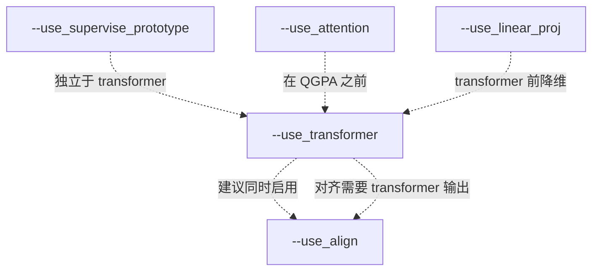

# 第16课：参数标志与模型变体

## 1. 本节学习目标

- 理清各个 `--use_xxx` 开关与模型变体的对应关系
- 理解不同 flag 组合对应的论文方法版本
- 能够根据论文描述选择正确的参数组合
- 掌握模型变体的代码选择逻辑

---

## 2. Feature Flags 全景图

PAP-FZS3D 通过 7 个布尔 flag 控制模型行为：

```python
# main.py 中的定义
--use_attention           # 自注意力模块
--use_transformer         # QGPA 交叉注意力
--use_align               # 原型对齐损失
--use_supervise_prototype # 原型自重建损失
--use_high_dgcnn          # 使用 DGCNN_semseg 骨干
--use_linear_proj         # 线性投影
--use_zero                # 零样本 GMMN 生成器
```

---

## 3. 三种主要方法

### 方法对比

| 方法 | 论文简称 | flag 组合 | 代码类 |
|---|---|---|---|
| 基础原型网络 | ProtoNet | 所有 flags OFF | `ProtoNet` |
| PAP (少样本) | PAP (QGPA+SR) | attention+transformer+align+supervise+high_dgcnn+linear_proj | `ProtoNetAlignQGPASR` |
| PAP-FZ (少+零) | PAP-FZ | 同上 + zero | `ProtoNetAlignFZ` |

### 方法本质

```
ProtoNet:  编码 → 原型 → 余弦相似度    (最简单)
PAP:       编码 → 原型 → QGPA 自适应 → 余弦相似度 + 辅助损失
PAP-FZ:    编码 → 原型 → QGPA 自适应 → 余弦相似度 + GMMN 生成
```

---

## 4. 模型选择链路

### 在 proto_train.py 中

```python
def proto_main(args):
    # Step 1: 根据 flags 选择模型类
    if args.use_zero:
        model = ProtoNetAlignFZ(args)      # 含 GMMN
        learner = ProtoLearnerFZ(args)
    elif args.use_transformer:
        model = ProtoNetAlignQGPASR(args)  # 含 QGPA+SR
    else:
        model = ProtoNet(args)             # 基础版
        learner = ProtoLearner(args)
    
    # Step 2: 加载预训练 encoder
    if args.pretrain_checkpoint:
        checkpoint = torch.load(args.pretrain_checkpoint)
        model.encoder.load_state_dict(
            checkpoint['model_state_dict'],
            strict=False  # 允许部分加载
        )
```

### 各 flag 在模型中的作用范围

| Flag | ProtoNet | ProtoNetAlignQGPASR | ProtoNetAlignFZ |
|---|---|---|---|
| `use_high_dgcnn` | ✅ | ✅ | ✅ |
| `use_attention` | ❌ | ✅ | ✅ |
| `use_transformer` | ❌ | ✅ | ✅ |
| `use_align` | ❌ | ✅ | ✅ |
| `use_supervise_prototype` | ❌ | ✅ | ✅ |
| `use_linear_proj` | ❌ | ✅ | ✅ |
| `use_zero` | ❌ | ❌ | ✅ |

---

## 5. 深入：ProtoNetAlignQGPASR 的 flag 解读

```python
class ProtoNetAlignQGPASR(nn.Module):
    def __init__(self, args):
        super().__init__()
        
        # 1. 编码器
        if args.use_high_dgcnn:
            self.encoder = DGCNN_semseg(args)  # 新版，特征更好
        else:
            self.encoder = DGCNN(args)          # 旧版
        
        # 2. 自注意力 (可选)
        if args.use_attention:
            self.attention = SelfAttention(args.output_dim)
        
        # 3. 线性投影 (可选)
        if args.use_linear_proj:
            self.linear_proj = nn.Linear(args.train_dim, args.output_dim)
        
        # 4. QGPA 转换器 (可选)
        if args.use_transformer:
            self.transformer = QGPA(
                dim=args.output_dim,
                num_heads=1
            )
        
        # 5. 自重建模块 (可选)
        if args.use_supervise_prototype:
            self.reconstructor = nn.Sequential(
                nn.Linear(args.output_dim, 128),
                nn.ReLU(),
                nn.Linear(128, args.output_dim)
            )
```

### Flag 依赖关系



---

## 6. 消融实验：各 Flag 的影响

### 论文消融实验（预期效果）

```
配置                                    mIoU (2-way 1-shot S3DIS)
────────────────────────────────────────────────────────────
ProtoNet (基准)                         45.2%
  + Self-Attention                      47.1%  (+1.9%)
  + QGPA                                50.3%  (+3.2%)
  + SR (Self-Reconstruction)            51.5%  (+1.2%)
  + Alignment Loss                      52.8%  (+1.3%)
  = PAP (完整)                          52.8%
  + GMMN (Zero-shot)                    48.1%* (*含 unseen 类)
```

### 运行消融实验

```bash
# 基准: ProtoNet
python main.py --phase prototrain --dataset S3DIS --cvfold 0 \
    --n_way 2 --k_shot 1 --use_high_dgcnn

# +Attention
python main.py --phase prototrain --dataset S3DIS --cvfold 0 \
    --n_way 2 --k_shot 1 --use_high_dgcnn --use_attention

# +QGPA
python main.py --phase prototrain --dataset S3DIS --cvfold 0 \
    --n_way 2 --k_shot 1 --use_high_dgcnn \
    --use_attention --use_transformer --use_linear_proj

# 完整 PAP
python main.py --phase prototrain --dataset S3DIS --cvfold 0 \
    --n_way 2 --k_shot 1 --use_high_dgcnn \
    --use_attention --use_transformer --use_linear_proj \
    --use_align --use_supervise_prototype

# PAP-FZ
python main.py --phase prototrain --dataset S3DIS --cvfold 0 \
    --n_way 2 --k_shot 1 --use_high_dgcnn \
    --use_attention --use_transformer --use_linear_proj \
    --use_align --use_supervise_prototype --use_zero
```

---

## 7. 常见组合错误

### ❌ 错误组合

```bash
# 1. 开了 transformer 但没开 linear_proj
--use_transformer    # QGPA 在 train_dim=320 上工作，可能维度不匹配

# 2. 开了 align 但没开 transformer
--use_align          # align 需要 QGPA 的输出，单独使用无意义

# 3. 没开 use_high_dgcnn
# 使用旧版 DGCNN，性能可能更差

# 4. 开了 use_zero 但没预计算 GloVe
--use_zero           # 需要先运行 get_embedding.py
```

### ✅ 推荐组合

```bash
# 完整 PAP（论文最优配置）
--use_high_dgcnn \
--use_attention \
--use_transformer \
--use_linear_proj \
--use_align \
--use_supervise_prototype
```

---

## 8. 本节总结

| 方法 | 类 | 关键 Flags | 论文 |
|---|---|---|---|
| ProtoNet | `ProtoNet` | — | Snell et al. 2017 |
| PAP | `ProtoNetAlignQGPASR` | all except `use_zero` | He et al. 2023 |
| PAP-FZ | `ProtoNetAlignFZ` | all + `use_zero` | He et al. 2023 |

**关键记忆点**：
- `use_high_dgcnn` 是基础（总是建议开启）
- `use_transformer` 是 PAP 的核心
- `use_zero` 是 PAP-FZ 的唯一区别

---

## 9. 课后练习

1. 绘制所有 7 个 flag 的决策树，标注每种组合对应的模型类
2. 运行 3 种配置的消融实验（ProtoNet / PAP(无SR) / 完整PAP），对比结果
3. 在代码中搜索 `args.use_transformer`，记录所有受影响的代码位置
4. 设计你自己的 flag 组合实验，验证 align loss 和 SR loss 的相对重要性
