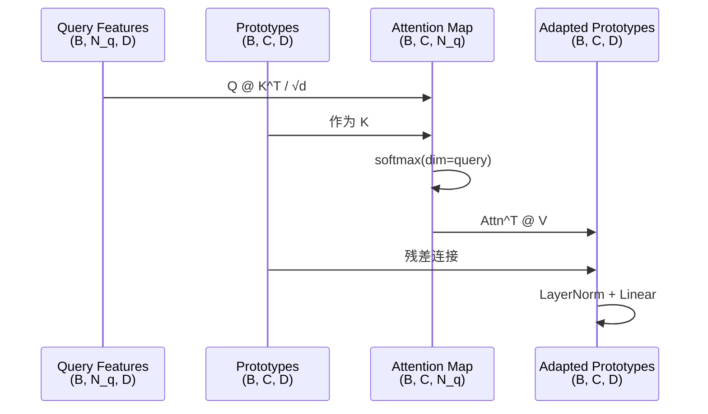

# 第18课：交叉注意力与 QGPA 模块

## 1. 本节学习目标

- 理解 Query-Guided Prototype Alignment (QGPA) 的设计动机
- 掌握交叉注意力（Cross-Attention）的原理
- 能够阅读和理解 `models/attention.py` 中的 QGPA 类
- 理解 QGPA 如何根据 query 场景自适应调整原型

---

## 2. 问题：原型为什么需要自适应？

### 原型的固有问题

```
理想情况:
  support 场景和 query 场景完全相同
  → 原型直接适用

实际情况:
  support: 会议室中的桌子（被椅子包围，光照明亮）
  query:   卧室中的桌子（靠墙，光照较暗）
  → 同一个"桌子"类，但外观差异很大！
  → 固定的原型无法适应场景变化
```

### QGPA 的核心思想

> 让 query 引导原型的自适应调整：**根据当前查询场景的特点，动态地微调原型向量，使其更适合当前场景。**

```
固定原型:     P_fixed = mean(support_features)
自适应原型:   P_adapted = P_fixed + ΔP(query_context)
```

---

## 3. 交叉注意力 vs 自注意力

### 区别

| 特性 | Self-Attention | Cross-Attention (QGPA) |
|---|---|---|
| Q 来源 | 自身 (x) | Query 特征 |
| K, V 来源 | 自身 (x) | Support 原型 |
| 目的 | 增强自身特征的全局信息 | 用 query 调整 support 原型 |
| 注意力矩阵形状 | (N, N) | (N_query, N_prototypes) |

### 交叉注意力公式

$$\text{QGPA}(Q_q, K_p, V_p) = \text{softmax}\left(\frac{Q_q K_p^T}{\sqrt{d}}\right)V_p$$

```
Q_q: Query 场景的点特征  (N, D)
K_p: Support 原型的键表示 (C, D)
V_p: Support 原型的值表示 (C, D)

注意力: 每个 query 点关注哪些原型
输出:   query-guided 的自适应原型
```

---

## 4. QGPA 类完整代码解读

```python
# models/attention.py
class QGPA(nn.Module):
    """
    Query-Guided Prototype Alignment
    根据 query 特征调整 support 原型
    """
    def __init__(self, dim, num_heads=1):
        super().__init__()
        self.dim = dim
        self.num_heads = num_heads
        
        # 投影层
        self.to_q = nn.Linear(dim, dim)   # Query 投影
        self.to_k = nn.Linear(dim, dim)   # Key 投影 (从原型)
        self.to_v = nn.Linear(dim, dim)   # Value 投影 (从原型)
        
        # 输出投影 + LayerNorm
        self.project_out = nn.Sequential(
            nn.LayerNorm(dim),
            nn.Linear(dim, dim)
        )
    
    def forward(self, query_feat, prototypes):
        """
        Args:
            query_feat:  (B, N_q, dim)  query 点的特征
            prototypes:  (B, C, dim)    support 原型 (C = n_way)
        
        Returns:
            adapted_prototypes: (B, C, dim)
            attention_maps:     (B, C, N_q)  # 注意力分布
        """
        B, N_q, dim = query_feat.shape
        C = prototypes.shape[1]
        
        # Step 1: 投影 Q, K, V
        Q = self.to_q(query_feat)      # (B, N_q, dim)
        K = self.to_k(prototypes)      # (B, C, dim)
        V = self.to_v(prototypes)      # (B, C, dim)
        
        # Step 2: 计算交叉注意力
        # Q @ K^T → (B, N_q, C)
        scale = dim ** 0.5
        attention = torch.bmm(Q, K.transpose(1, 2)) / scale
        attention = F.softmax(attention, dim=1)  # (B, N_q, C)
        # 注意: softmax 在 N_q 维度，不是 C 维度
        # 意味着: 每个原型关注哪些 query 点
        
        # Step 3: 注意力加权
        # attention^T @ V → (B, C, dim)
        adapted = torch.bmm(attention.transpose(1, 2), V)
        # 每个原型的更新 = 所有 query 点的 V 的加权和
        
        # Step 4: 残差连接 + LayerNorm
        adapted = self.project_out(adapted + prototypes)
        
        return adapted, attention.transpose(1, 2)  # (B, C, N_q)
```

### 为什么 softmax 在 N_q 维度？

```
标准 Self-Attention: softmax 在 K 维度 (每个 query 关注哪些 key)
QGPA:                softmax 在 Query 维度 (每个 prototype 关注哪些 query 点)

含义:
  查询 → 原型:  哪个原型更适合这个点？
  原型 → 查询:  这个原型应该从哪些 query 点获取信息？

QGPA 用后者，因为目标是通过 query 聚合来更新原型。
```

---

## 5. QGPA 的工作流程可视化



---

## 6. 张量形状追踪（典型配置）

```
输入:
  query_feat: (1, 2048, 64)     # B=1, N_q=2048, D=64
  prototypes: (1, 2, 64)        # C=2 (2-way)

Step 1 - 投影:
  Q: (1, 2048, 64)
  K: (1, 2, 64)
  V: (1, 2, 64)

Step 2 - 注意力:
  Q @ K^T: (1, 2048, 64) @ (1, 64, 2) = (1, 2048, 2)
  softmax(dim=1): (1, 2048, 2)
  含义: 每个点对 2 个原型的注意力

Step 3 - 加权:
  Attn^T @ V: (1, 2, 2048) @ (1, 2048, 64) = (1, 2, 64)
  含义: 每个原型聚合了 2048 个 query 点的信息

Step 4 - 残差:
  Adapted = Project( adapted + prototypes )
  输出: (1, 2, 64)
```

---

## 7. 注意力映射的解释

```python
# attention_maps: (B, C, N_q)

# 对于 2-way 问题:
# attention_maps[0, 0, :] → 原型0 (如 table) 对每个 query 点的关注度
# attention_maps[0, 1, :] → 原型1 (如 chair) 对每个 query 点的关注度

# 理想情况:
#   - table 原型关注的是"像桌子"的点
#   - chair 原型关注的是"像椅子"的点
#   → 原型自适应地学习到哪些 query 区域属于自己
```

---

## 8. QGPA 与 Self-Attention 的协同

在 PAP 中，两者串联使用：

```
Query 特征 (2048, 256)
  → Self-Attention → (2048, 256)  # 增强 query 内部关系
  → 线性投影 → (2048, 64)        # 降维
  → QGPA (with Prototypes) → 自适应原型 (2, 64)
  → 余弦相似度 → 分类
```

**为什么需要 Self-Attention 在 QGPA 之前？**

```
Self-Attention 让 query 特征内部传播了上下文信息
→ 每个 query 点不只是"自己"，还融合了周围点的信息
→ QGPA 接收的 query 特征更丰富
→ 原型自适应更准确
```

---

## 9. 本节总结

| 概念 | 要点 |
|---|---|
| QGPA 动机 | 固定原型无法适应不同场景的外观变化 |
| 交叉注意力 | Q 来自 query，K, V 来自 prototype |
| Softmax 方向 | dim=query → 每个原型"选择"关注哪些 query 点 |
| 残差连接 | adapted = prototype + query_context |
| 注意力映射 | (B, C, N_q)，C 个原型对 N_q 个点的关注度 |

---

## 10. 课后练习

1. 在 QGPA.forward() 中添加可视化代码，绘制注意力映射的热力图
2. 修改 softmax 方向为 dim=C（每个 query 点选择原型），对比效果
3. 去掉 QGPA 的残差连接，训练一个 epoch，观察 loss 变化
4. 分析：如果 query 场景中不包含某个 prototype 对应的类别，该 prototype 的注意力 map 是什么样的？
