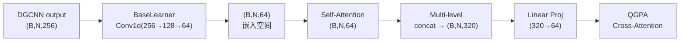

# 第19课：特征投影与 BaseLearner

## 1. 本节学习目标

- 理解 BaseLearner (Conv1d 层) 的作用
- 掌握多级特征拼接（concat multi-level features）的实现
- 理解线性投影（--use_linear_proj）的设计
- 能够追踪特征维度的完整变换过程

---

## 2. 特征投影的需求

### 问题：特征维度不匹配

```
DGCNN 输出: (B, N, 256)  或  拼接后: (B, N, 320)
QGPA 输入: (B, N, 64)    原型空间: (B, C, 64)

需要:
  256/320 维 → 64 维 → 84/160 维(concat) → 320 维(train_dim)
  └── BaseLearner ──┘   └─── Self-Attention + multi-level concat ───┘
```

### 特征变换全链路



---

## 3. BaseLearner 详解

### 代码实现

```python
# models/protonet_QGPA.py (简化)
class BaseLearner(nn.Module):
    """
    将 DGCNN 的特征精炼为原型网络的嵌入
    """
    def __init__(self, in_channels, widths):
        super().__init__()
        layers = []
        for i, w in enumerate(widths):
            layers.extend([
                nn.Conv1d(in_channels if i == 0 else widths[i-1], w, 1),
                nn.BatchNorm1d(w),
                nn.ReLU()
            ])
        self.convs = nn.Sequential(*layers)
    
    def forward(self, x):
        """
        x: (B, C_in, N)  # 注意: 通道在 dim=1
        返回: (B, C_out, N)
        """
        return self.convs(x)

# 初始化
# in_channels=256 (DGCNN 输出)
# widths=[128, 64]    (两层 Conv1d)
# 输出: 64 维
```

### 默认配置下的流程

```
输入:  (B, 256, 2048)
  → Conv1d(256, 128, 1) → BN → ReLU → (B, 128, 2048)
  → Conv1d(128, 64, 1)  → BN → ReLU → (B, 64, 2048)
输出:  (B, 64, 2048)
```

### 为什么用 1x1 Conv (Conv1d kernel_size=1)?

```
1x1 Conv = 对每个点独立做全连接
        = 逐点的特征变换，不涉及邻域

这和 PointNet 的思想一致:
  - 逐点 MLP (共享权重)
  - 不破坏点的独立性
```

---

## 4. 多级特征拼接 (Multi-Level Feature Concatenation)

### 动机

```
问题: 只用最后一层特征丢失了中间层的信息
解决方案: 拼接多层的特征

DGCNN 输出 3 层 EdgeConv 特征:
  EC1:  (B, N, 64)   → 局部几何
  EC2:  (B, N, 64)   → 中层形状
  EC3:  (B, N, 64)   → 全局结构

直接拼接:
  Concat[EC1, EC2, EC3] → (B, N, 192)  (DGCNN 内部已做)

经过 BaseLearner 后:
  feat_64: (B, N, 64)  # BaseLearner 输出
  
再拼接 DGCNN 的中间特征:
  feat_ec1: (B, N, 64)
  feat_ec2: (B, N, 64)
  feat_ec3: (B, N, 64)
  
  concat_feat = [feat_64, feat_ec1, feat_ec2, feat_ec3]
  → (B, N, 256)  # 64 + 64 + 64 + 64 = 256
```

### 代码中的实现

```python
# 在 protonet_QGPA.py 中
def forward(self, support_x, support_y, query_x, query_y):
    ...
    # 编码时保存中间特征
    feat, edgeconv_feats = self.encoder(x, return_mid=True)
    # feat: (B, N, 256)
    # edgeconv_feats: [EC1, EC2, EC3] → 每个 (B, N, 64)
    
    # BaseLearner
    feat_64 = self.base_learner(feat.transpose(1,2)).transpose(1,2)
    # (B, N, 64)
    
    # 多级拼接
    multi_level = [feat_64] + edgeconv_feats  # 4 个 (B, N, 64)
    concat_feat = torch.cat(multi_level, dim=-1)  # (B, N, 256)
```

---

## 5. 线性投影 (--use_linear_proj)

### 作用

将拼接后的高维特征映射到 QGPA 所需的空间：

```python
# models/protonet_QGPA.py
self.linear_proj = nn.Linear(train_dim, output_dim)
# train_dim = 256 + 64 = 320 (拼接后)
# output_dim = 64

def forward(self, ...):
    concat_feat = ...  # (B, N, train_dim)
    
    if self.use_linear_proj:
        feat_64 = self.linear_proj(concat_feat)  # (B, N, 64)
        # 进入 self-attention + QGPA
    else:
        feat_64 = concat_feat[:, :, :64]  # 只用前 64 维
```

### 为什么需要 projection？

```
train_dim (320) 包含:
  - BaseLearner 输出 (64维)
  - 3 层 EdgeConv 中间特征 (3 × 64 = 192维)
  - 可能的其他特征 (64维)
  = 320 维
  
QGPA 工作在 64 维空间
→ 需要 Linear(320, 64) 降维
→ projection 是可学习的 → 最优融合多级信息
```

---

## 6. 完整的特征维度变化表

以 `B=1, N=2048, parts=9, n_way=2, k_shot=1` 为例：

```
步骤              模块                       输入                    输出
────────────────────────────────────────────────────────────────────
输入              原始点云                   (1,3,2048,9)          -
编码              DGCNN_semseg              (3,2048,9)            (3,2048,256)
BaseLearner       Conv1d(256→128→64)         (3,256,2048)          (3,64,2048)
转置              -                         (3,64,2048)           (3,2048,64)
分离              -                         合并                   support(2,1,2048,64)
                                                                   query(1,1,2048,64)
自注意力          SelfAttention             (1,2048,64)           (1,2048,64)
多级拼接          Concat[feat+3EC]           (1,2048,64)           (1,2048,320)
线性投影          Linear(320,64)             (1,2048,320)          (1,2048,64)
原型计算          Masked AvgPool             (2,2048,64)           (1,2,64)
QGPA              QGPA                       (1,2048,64)+(1,2,64)  (1,2,64)
余弦相似度        CosSim                     (1,2048,64)+(1,2,64)  (1,2048,2)
损失              CrossEntropy               (1,2,2048)            scalar
```

---

## 7. 本节总结

| 模块 | 功能 | 输入维度 | 输出维度 |
|---|---|---|---|
| DGCNN_semseg | 点云特征提取 | 9 | 256 |
| BaseLearner | 特征精炼 | 256 | 64 |
| Multi-Level Concat | 多级信息融合 | 4×64 | 256~320 |
| Linear Projection | 降维到 QGPA 空间 | 320 | 64 |

**设计原则**：
1. DGCNN 提取丰富的几何特征 → 256 维
2. BaseLearner 压缩到原型空间 → 64 维
3. 拼接中间特征保留多尺度信息
4. 线性投影学习最优融合 → QGPA 就绪

---

## 8. 课后练习

1. 追踪 `--use_linear_proj=False` 时的特征维度变化
2. 修改 BaseLearner 的 widths 为 [256, 128, 64]，观察对训练的影响
3. 可视化 DGCNN 的 3 层 EdgeConv 中间特征，分析每层学到的信息
4. 去掉多级拼接（只用 BaseLearner 输出），对比性能变化
