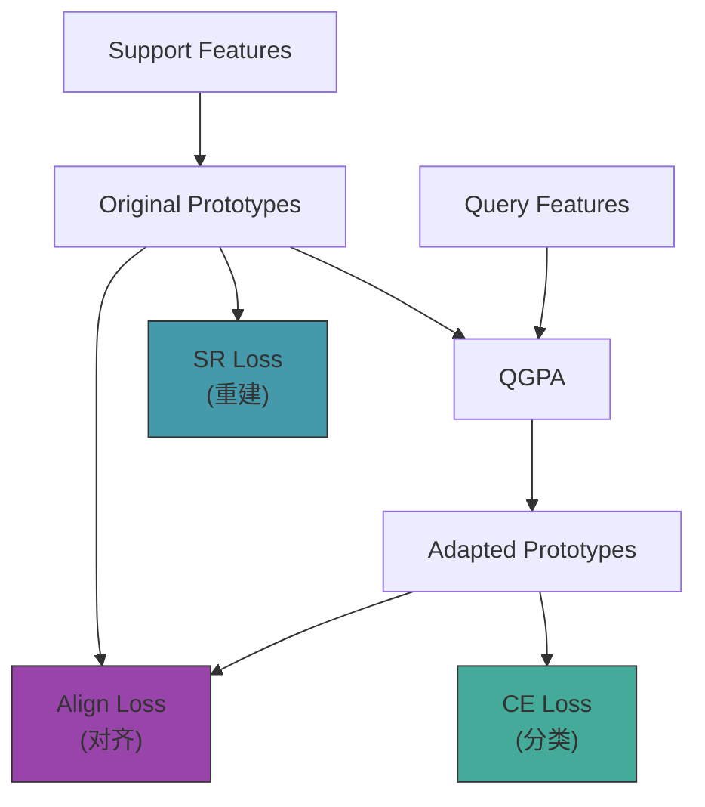

# 第21课：原型对齐损失 (Alignment Loss)

## 1. 本节学习目标

- 理解原型对齐损失（Alignment Loss）的原理
- 掌握 `--use_align` 的工作机制
- 理解 QGPA 输出与原始原型的对齐目标
- 能够分析对齐损失对训练的影响

---

## 2. 问题：自适应后的原型可能"漂移"

### 原型自适应后的风险

```
原始原型 (从 support 计算):
  p_original = mean( support_features )
  → 忠实反映 support 数据的分布

QGPA 自适应后:
  p_adapted = QGPA(query, p_original)
  → 融合了 query 场景信息

风险: 
  p_adapted 可能过度偏向 query 场景
  → 丢失了 support 的类别定义信息
  → 极端情况下，原型完全变成了 query 特征的平均
```

### Alignment Loss 的思路

> 自适应后的原型应当与原始原型保持"对齐"——既融合 query 信息，又不丢失 support 语义。

---

## 3. 数学定义

$$\mathcal{L}_{align} = \| p_{adapted} - p_{original} \|_2^2$$

或使用余弦距离：

$$\mathcal{L}_{align} = 1 - \cos(p_{adapted}, p_{original})$$

### 总损失（含对齐）

$$\mathcal{L}_{total} = \mathcal{L}_{CE} + \lambda_{SR} \cdot \mathcal{L}_{SR} + \lambda_{align} \cdot \mathcal{L}_{align}$$

---

## 4. 代码实现

### 在 protonet_QGPA.py 中

```python
def forward(self, support_x, support_y, query_x, query_y):
    ...
    # Step 1: 计算原始原型
    original_prototypes = self._compute_prototypes(
        support_feat, support_y
    )  # (B, C, D)
    
    # Step 2: QGPA 自适应
    if self.args.use_transformer:
        adapted_prototypes, attn_maps = self.transformer(
            query_feat, original_prototypes
        )  # (B, C, D)
    else:
        adapted_prototypes = original_prototypes
    
    # Step 3: 计算对齐损失
    align_loss = 0.0
    if self.args.use_align and self.args.use_transformer:
        align_loss = self._compute_align_loss(
            original_prototypes, adapted_prototypes
        )
    
    # Step 4: 分类
    similarity = cosine_similarity(query_feat, adapted_prototypes)
    ce_loss = F.cross_entropy(similarity, query_labels)
    
    # Step 5: 总损失
    total_loss = ce_loss + \
                 sr_weight * sr_loss + \
                 align_weight * align_loss
    
    return total_loss, acc

def _compute_align_loss(self, original, adapted):
    """
    Args:
        original: (B, C, D) 原始原型
        adapted:  (B, C, D) 自适应原型
    Returns:
        scalar: alignment loss
    """
    # 方法1: MSE
    # loss = F.mse_loss(adapted, original)
    
    # 方法2: 余弦距离 (1 - cos)
    original_norm = F.normalize(original, dim=-1)
    adapted_norm = F.normalize(adapted, dim=-1)
    cos_sim = (original_norm * adapted_norm).sum(dim=-1)  # (B, C)
    loss = (1 - cos_sim).mean()
    
    return loss
```

---

## 5. 对齐损失的直观理解

### 三种场景

```python
# 假设 2-way，类 0 = table, 类 1 = chair

# 场景 A: 完美对齐
p_orig[0] = [0.8, 0.1, -0.3]   # table 原始原型
p_adpt[0] = [0.78, 0.12, -0.28] # table 自适应后（微调）
cos_sim = 0.99  →  align_loss ≈ 0.01  ✅ 很好

# 场景 B: 适度调整
p_orig[0] = [0.8, 0.1, -0.3]
p_adpt[0] = [0.5, 0.5, 0.2]     # 显著变化
cos_sim = 0.7  →  align_loss ≈ 0.3  ⚠️ 需注意

# 场景 C: 严重漂移
p_orig[0] = [0.8, 0.1, -0.3]
p_adpt[0] = [-0.7, -0.2, 0.5]   # 几乎相反
cos_sim = -0.5 →  align_loss ≈ 1.5  ❌ 需要惩罚
```

---

## 6. Align Loss 与其他损失的关系



三种损失各自的监督信号：

| 损失 | 来源 | 目标 | 梯度流向 |
|---|---|---|---|
| CE Loss | query labels | 正确分类 | prototype + encoder |
| SR Loss | support features | 原型可重建 | prototype + decoder |
| Align Loss | original prototypes | 不过度漂移 | adapted prototype |

---

## 7. 权重配置实验

```python
# 不同 align_weight 的效果 (示意)
align_weight = 0.0    # 无用 → 原型可能漂移
align_weight = 0.01   # 轻微约束 → 大多数情况合适
align_weight = 0.1    # 适度约束 → 推荐
align_weight = 1.0    # 强约束 → 接近不适用 QGPA
align_weight = 10.0   # 过强 → QGPA 退化为恒等映射
```

### 选择原则

```
观察训练过程中 original_prototype 和 adapted_prototype 的余弦相似度:
  - 如果 cos > 0.95: align_weight 可以小 (0.01)
  - 如果 cos < 0.8:  align_weight 应加大 (0.1~0.5)
  - 目标: cos ≈ 0.85~0.95 (有调整但不过度)
```

---

## 8. 本节总结

| 概念 | 要点 |
|---|---|
| 动机 | 防止 QGPA 使原型过拟合 query 场景 |
| 定义 | `1 - cos(p_original, p_adapted)` |
| 损失权重 | 通常 0.01~0.1 |
| 核心思想 | 自适应原型既要适配 query，又不能丢失 support 语义 |
| 与 CE 的关系 | CE 驱动力 + Align 约束力 = 最佳自适应 |

---

## 9. 课后练习

1. 在训练中记录 `original` 和 `adapted` 原型的余弦相似度曲线
2. 关闭 align loss，观察 100 个 episode 后原型的余弦相似度变化
3. 尝试用 L1 loss 替代余弦距离，对比训练稳定性
4. 设计实验：测量不同 align_weight 下，原型的 inter-class distance 变化
