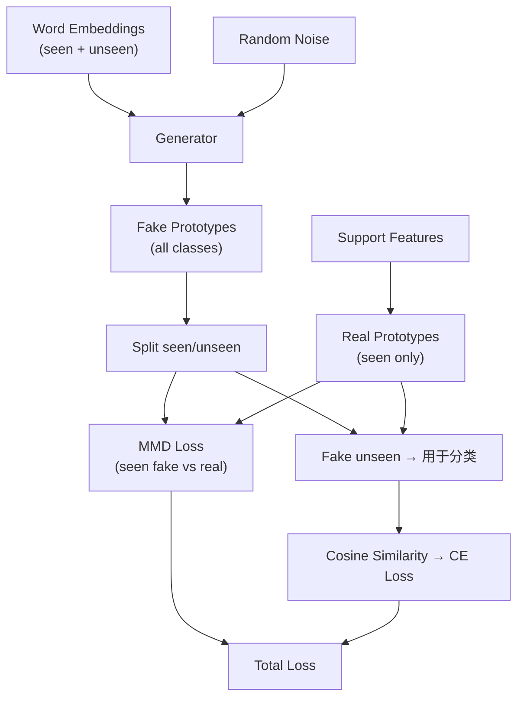

# 第23课：GMMN 生成器

## 1. 本节学习目标

- 理解 GMMN (Generative Moment Matching Network) 的原理
- 掌握 Maximum Mean Discrepancy (MMD) 损失
- 能够阅读和理解 `models/gmmn.py` 的完整实现
- 理解从词嵌入到视觉原型的映射

---

## 2. 问题：如何从词嵌入得到视觉原型

### 跨模态映射

```
输入 (语义空间):  词向量 ∈ ℝ^300
输出 (视觉空间):  伪原型 ∈ ℝ^64

需要: 一个生成器 G: ℝ^300 → ℝ^64

挑战:
  1. 没有 unseen class 的"真实视觉原型"作为监督
  2. 只有 seen class 的 (词嵌入, 视觉原型) 配对
  3. 目标: G 学到的映射能泛化到 unseen classes
```

### GMMN 的思路

> 用 seen classes 训练生成器，使生成的伪原型分布匹配真实原型的分布。

---

## 3. GMMN 网络结构

### Generator

```python
# models/gmmn.py
class GMMNnetwork(nn.Module):
    """
    生成器：词嵌入 + 噪声 → 视觉原型
    """
    def __init__(self, embedding_dim=300, noise_dim=300, output_dim=64):
        super().__init__()
        self.input_dim = embedding_dim + noise_dim
        
        self.generator = nn.Sequential(
            nn.Linear(self.input_dim, 512),
            nn.BatchNorm1d(512),
            nn.ReLU(),
            nn.Dropout(0.3),
            
            nn.Linear(512, 256),
            nn.BatchNorm1d(256),
            nn.ReLU(),
            nn.Dropout(0.3),
            
            nn.Linear(256, 128),
            nn.BatchNorm1d(128),
            nn.ReLU(),
            
            nn.Linear(128, output_dim)
        )
    
    def forward(self, word_embeddings, noise):
        """
        Args:
            word_embeddings: (B, C, 300)  词嵌入
            noise:           (B, C, 300)  随机噪声
        Returns:
            fake_prototypes: (B, C, 64)   生成的伪原型
        """
        x = torch.cat([word_embeddings, noise], dim=-1)  # (B, C, 600)
        x = x.view(-1, self.input_dim)                    # (B*C, 600)
        out = self.generator(x)                            # (B*C, 64)
        out = out.view(word_embeddings.shape[0], -1, self.output_dim)  # (B, C, 64)
        return out
```

### 张量形状追踪

```
输入:
  词嵌入:     (1, 6, 300)    # B=1, C=6 classes, 300-dim GloVe
  噪声:        (1, 6, 300)    # 随机采样

拼接:         (1, 6, 600)
展平:         (6, 600)
Generator:    (6, 64)        # 6 个伪原型
重塑:         (1, 6, 64)
```

---

## 4. MMD 损失 (Maximum Mean Discrepancy)

### 动机

传统 GAN 用判别器来判断"真假"，GMMN 不同——它直接比较分布之间的矩（moment）：

```
GAN:
  生成器 G → 假样本 → 判别器 D → 真/假 → GAN Loss

GMMN:
  生成器 G → 假样本 → 直接比较假样本分布 P_G 和真样本分布 P_real
                      → 用 MMD 度量差异
```

### MMD 公式

$$\text{MMD}^2(P, Q) = \mathbb{E}_{x,x'} [k(x, x')] + \mathbb{E}_{y,y'} [k(y, y')] - 2 \mathbb{E}_{x,y} [k(x, y)]$$

其中 $k(\cdot, \cdot)$ 是核函数（kernel function）。

### 直观解释

```
MMD = "真实分布内"的平均相似度
    + "生成分布内"的平均相似度
    - 2 * "真实与生成之间"的平均相似度

如果两个分布相同 → MMD ≈ 0
如果两个分布不同 → MMD > 0
```

---

## 5. GMMNLoss 代码实现

```python
# models/gmmn.py
class GMMNLoss(nn.Module):
    """
    Maximum Mean Discrepancy Loss with multi-bandwidth Gaussian kernels
    """
    def __init__(self, sigma_list=[2, 5, 10, 20, 40, 80]):
        super().__init__()
        self.sigma_list = sigma_list
    
    def forward(self, real_prototypes, fake_prototypes):
        """
        Args:
            real_prototypes: (N_real, D)  真实原型
            fake_prototypes: (N_fake, D)  生成原型
        Returns:
            mmd_loss: scalar
        """
        # 展平 batch 维度
        real = real_prototypes.view(-1, real_prototypes.shape[-1])
        fake = fake_prototypes.view(-1, fake_prototypes.shape[-1])
        
        total_mmd = 0.0
        
        for sigma in self.sigma_list:
            # 计算高斯核矩阵
            K_xx = self._gaussian_kernel(real, real, sigma)
            K_yy = self._gaussian_kernel(fake, fake, sigma)
            K_xy = self._gaussian_kernel(real, fake, sigma)
            
            # MMD 计算
            mmd = K_xx.mean() + K_yy.mean() - 2 * K_xy.mean()
            total_mmd += mmd
        
        return total_mmd / len(self.sigma_list)
    
    def _gaussian_kernel(self, x, y, sigma):
        """
        高斯核: k(x, y) = exp(-||x - y||^2 / (2 * sigma^2))
        """
        # 计算 pairwise 距离
        x_norm = (x ** 2).sum(dim=1).view(-1, 1)  # (N_x, 1)
        y_norm = (y ** 2).sum(dim=1).view(1, -1)  # (1, N_y)
        dist = x_norm + y_norm - 2 * torch.mm(x, y.t())  # (N_x, N_y)
        
        return torch.exp(-dist / (2 * sigma ** 2))
```

### 为什么用多个带宽 (sigma)?

```
单一 sigma 的问题:
  - 太小: 只看局部，忽略整体分布
  - 太大: 太平滑，无法区分细微差异

多 sigma 策略 [2,5,10,20,40,80]:
  - sigma=2:  捕获细粒度的分布差异
  - sigma=10: 捕获中等尺度的分布差异
  - sigma=80: 捕获全局的分布匹配
  → 多尺度分布匹配
```

---

## 6. GMMN vs GAN

| 特性 | GAN | GMMN |
|---|---|---|
| 训练方式 | 对抗（min-max） | 直接优化（min） |
| 稳定性 | 需要平衡 G 和 D | 训练稳定 |
| 额外网络 | 需要判别器 D | 不需要 |
| 损失函数 | 对抗损失 | MMD (核函数) |
| 模式坍塌 | 常见问题 | 较少发生 |
| 适用场景 | 图像生成 | 低维特征生成 |

**PAP 选择 GMMN 的原因**：
1. 视觉原型是 64 维向量，不需要复杂生成器
2. GMMN 训练稳定，不需要调 G/D 平衡
3. Few-Shot 场景下数据少，GAN 容易过拟合

---

## 7. 完整生成 + 分类流程

```python
# 在 ProtoNetAlignFZ 中
def forward(self, support_x, support_y, query_x, query_y, class_names):
    ...
    # 1. 计算真实原型 (seen classes)
    real_prototypes = self._compute_prototypes(
        support_feat, support_y
    )  # (B, C_seen, D)
    
    # 2. 获取所有类的词嵌入 (seen + unseen)
    all_embeddings = self._get_embeddings(class_names)  # (B, C_all, 300)
    
    # 3. 生成伪原型 (只对 unseen)
    noise = torch.randn(B, C_all, self.noise_dim)
    fake_prototypes = self.generator(all_embeddings, noise)  # (B, C_all, D)
    
    # 4. 计算 GMMN 损失 (用 seen 的真实 vs 生成)
    seen_fake = fake_prototypes[:, seen_indices]  # 只用 seen 计算 MMD
    gmmn_loss = self.gmmn_loss(real_prototypes, seen_fake)
    
    # 5. 分类：用真实原型(seen) + 生成原型(unseen)
    all_prototypes = []  # 拼接
    for c in range(C_all):
        if c in seen_indices:
            all_prototypes.append(real_prototypes[:, c])
        else:
            all_prototypes.append(fake_prototypes[:, c])
    all_prototypes = torch.stack(all_prototypes, dim=1)
    
    # 6. 余弦相似度 + 损失
    similarity = cosine(query_feat, all_prototypes)
    ce_loss = F.cross_entropy(similarity, query_labels)
    
    total_loss = ce_loss + gmmn_weight * gmmn_loss
    return total_loss, acc
```

---

## 8. 训练过程详解



---

## 9. 本节总结

| 概念 | 要点 |
|---|---|
| GMMN 的作用 | 从词嵌入生成未见类的视觉原型 |
| 生成器结构 | 4 层 MLP (600→512→256→128→64) |
| MMD 损失 | 多带宽高斯核 (σ ∈ [2,5,10,20,40,80]) |
| vs GAN | 更稳定，无需判别器，无模式坍塌 |
| 训练技巧 | 只用 seen classes 计算 MMD，unseen 靠泛化 |

---

## 10. 课后练习

1. 实现简化版 GMMN：只用单 sigma 的 MMD，对比多 sigma 的效果
2. 可视化生成的伪原型和真实原型在 t-SNE 空间中的分布
3. 尝试不同的噪声维度 (100, 300, 500)，观察生成质量
4. 用 Wasserstein 距离替代 MMD，实现并对比效果
